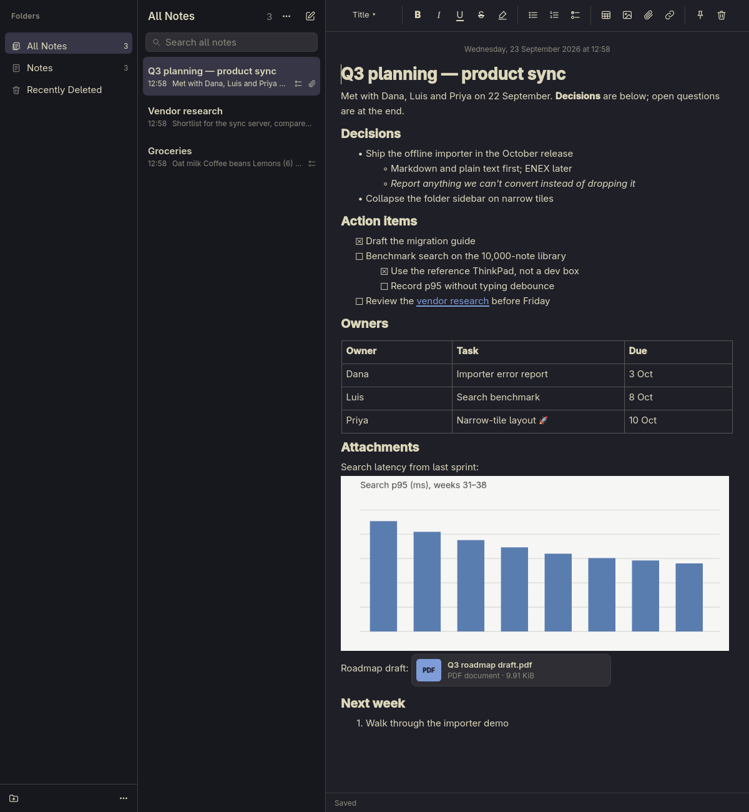

<div align="center">

# 📝 Omarchy Notes

**A fast, native notes app for [Omarchy](https://omarchy.org), inspired by Apple Notes.**

Rich notes with checklists, tables, images and attachments. They live on your machine and match your Omarchy theme.




</div>

---

## 👋 What is this?

The idea is simple: Apple Notes' easy note-taking, on Linux. Open it, start typing, and trust it's saved. It's a real desktop app built with Qt, not a web page in a wrapper. It works offline with no account, and it follows whatever Omarchy theme you're using, even when you switch themes while it's open.

> [!NOTE]
> **This is an alpha.** Everyday note-taking works: writing, folders, search, trash and backups. Tags, import/export and a Quick Note window are still to come. Check the [roadmap](#-roadmap) for what's next.

## ✨ What you can do today

- ⚡ **Start typing right away.** Notes save automatically, usually within a second. "Saved" only appears once your note is actually on disk.
- ✍️ **Format like you'd expect:** title, heading and subheading styles, plus bold, italic, underline, strikethrough, highlight and monospace.
- ✅ **Checklists and lists.** Bulleted, numbered and checklist items, nested as deep as you like. Click a checkbox to tick it off.
- 📊 **Tables.** Tab moves between cells, and Tab in the last cell adds a new row.
- 🖼️ **Images and attachments.** Add images from the toolbar or paste them in, and attach PDFs or any other file. Double-click one to open it in its usual app.
- 🔗 **Link notes together.** Ctrl+L links to another note, and Ctrl+click follows a link.
- 🗂️ **Folders.** Nest folders as deep as you like, move notes between them, and use All Notes to see everything at once.
- 🔍 **Search everything.** Results appear as you type, with the matching words in bold. Partial words work too: "bench" finds "benchmark".
- 📌 **Pin what matters.** Pinned notes stay at the top. Sort the rest by date edited, date created or title.
- 🗑️ **Undo a delete.** Deleted notes wait in Recently Deleted for 30 days before they're gone for good. Deleting a folder moves its notes there too.
- 💾 **Backups you can trust.** One click saves a complete copy of your library, attachments included. Restoring checks the backup first and keeps your current notes aside, so you can always go back.
- 📋 **Copy and paste that behaves.** Copying between notes keeps everything intact. Text pasted from the web gets tidied into clean note formatting, and anything that can't come along, like images from other sites, gets a heads-up instead of vanishing silently.
- 🎨 **Matches your theme.** Colours come from your active Omarchy theme and are adjusted automatically when they'd be hard to read.
- 🌐 **Every language.** Emoji, right-to-left scripts, CJK and input methods (IME) all work.
- 🛟 **Hard to lose work.** If a save fails, your text stays on screen with Retry and Export buttons, and the app won't quit until your changes are safe or you choose to discard them.

## 🚀 Install

Omarchy Notes isn't packaged yet, so for now you build it from source. It only takes a minute.

**1. Install the build tools** (on Omarchy or any Arch system):

```bash
sudo pacman -S --needed qt6-base qt6-declarative qt6-wayland qt6-svg sqlite cmake ninja gcc
```

**2. Build and install it for your user:**

```bash
git clone https://github.com/jasona/omarchy-notes.git
cd omarchy-notes
cmake -S . -B build-release -G Ninja -DCMAKE_BUILD_TYPE=Release -DCMAKE_INSTALL_PREFIX="$HOME/.local"
cmake --build build-release
cmake --install build-release
```

That puts `omarchy-notes` in `~/.local/bin` and adds it to your app launcher.

**3. Open it:** press <kbd>Super</kbd> + <kbd>Space</kbd> and search for **Omarchy Notes**.

> [!TIP]
> If it doesn't show up in the launcher right away, run `omarchy restart shell` so the launcher picks up the new app.

To update later, `git pull` and run the last two `cmake` commands again. Your notes aren't touched.

## 🗂️ Where your notes live

Everything is stored in `~/.local/share/omarchy-notes/`: an SQLite database for your notes, plus a folder of attached files. Reinstalling or removing the app never touches it.

To back up, click **⋯** at the bottom of the folder list and choose **Back Up Library…**. You get a normal folder with a consistent copy of everything, which is safe to make while you're writing. **Restore from Backup…** in the same menu checks a backup before using it and sets your current notes aside next to the library, so nothing is lost if you change your mind.

Want a sandbox to play in? Point the app at a different folder and fill it with sample notes:

```bash
omarchy-notes --data-dir /tmp/notes-playground --samples
```

<details>
<summary><b>All command-line options</b></summary>

| Option | What it does |
|---|---|
| `--data-dir <dir>` | Use a notes library in a different folder |
| `--new` | Start with a fresh note |
| `--note <id>` | Open a specific note |
| `--samples` | Fill an empty library with example notes (a meeting note with a table, image and PDF, some research links, and a grocery list) |
| `--simulate-save-failure` | Make saves fail on purpose, to see how the app handles it. <kbd>Ctrl</kbd>+<kbd>Alt</kbd>+<kbd>Shift</kbd>+<kbd>F</kbd> toggles this while running |

</details>

## ⌨️ Keyboard shortcuts

| | Shortcut |
|---|---|
| New note · New folder | <kbd>Ctrl</kbd> <kbd>N</kbd> · <kbd>Ctrl</kbd> <kbd>Shift</kbd> <kbd>N</kbd> |
| Search all notes | <kbd>Ctrl</kbd> <kbd>Shift</kbd> <kbd>F</kbd> |
| Delete the selected note | <kbd>Delete</kbd> (in the note list) |
| Duplicate note | <kbd>Ctrl</kbd> <kbd>D</kbd> |
| Show or hide folders | <kbd>Ctrl</kbd> <kbd>Shift</kbd> <kbd>S</kbd> |
| Bold · Italic · Underline | <kbd>Ctrl</kbd> <kbd>B</kbd> · <kbd>Ctrl</kbd> <kbd>I</kbd> · <kbd>Ctrl</kbd> <kbd>U</kbd> |
| Strikethrough · Highlight · Monospace | <kbd>Ctrl</kbd> <kbd>Shift</kbd> <kbd>X</kbd> · <kbd>Ctrl</kbd> <kbd>Shift</kbd> <kbd>Y</kbd> · <kbd>Ctrl</kbd> <kbd>E</kbd> |
| Title · Heading · Subheading · Body | <kbd>Ctrl</kbd> <kbd>Shift</kbd> + <kbd>T</kbd> · <kbd>H</kbd> · <kbd>J</kbd> · <kbd>B</kbd> |
| Checklist · Tick an item | <kbd>Ctrl</kbd> <kbd>Shift</kbd> <kbd>L</kbd> · <kbd>Ctrl</kbd> <kbd>Shift</kbd> <kbd>U</kbd> |
| Bulleted · Numbered list | <kbd>Ctrl</kbd> <kbd>Shift</kbd> <kbd>8</kbd> · <kbd>Ctrl</kbd> <kbd>Shift</kbd> <kbd>7</kbd> |
| Indent · Outdent a list item | <kbd>Tab</kbd> · <kbd>Shift</kbd> <kbd>Tab</kbd> |
| Insert a table | <kbd>Ctrl</kbd> <kbd>Alt</kbd> <kbd>T</kbd> |
| Attach a file · Link to a note | <kbd>Ctrl</kbd> <kbd>Shift</kbd> <kbd>A</kbd> · <kbd>Ctrl</kbd> <kbd>L</kbd> |
| Follow a link · Open an attachment | <kbd>Ctrl</kbd> + click · double-click |

## 🗺️ Roadmap

| | Milestone | What it brings |
|---|---|---|
| ✅ | **Editor & storage** | Rich editing, autosave, crash-safe storage, theme support |
| ✅ | **Daily-use alpha** | Delete & trash, folders, pinning, search, backup & restore |
| 🔜 | **Local beta** | Tags, Smart Folders, gallery view, import/export, Quick Note, find in note |
| 📅 | **1.0** | Arch package, accessibility polish, performance targets met |
| 💭 | **After 1.0** | Locked notes, OCR, audio, sync between devices, sharing |

The full plan is in [`llm-docs/omarchy-notes-plan.md`](llm-docs/omarchy-notes-plan.md), with a visual version in [`llm-docs/roadmap.html`](llm-docs/roadmap.html) (download it and open it in a browser). Big technical decisions are written up in [`docs/decisions/`](docs/decisions/).

## 🛠️ Hacking on it

Build a debug version and run the tests:

```bash
cmake -S . -B build -G Ninja -DCMAKE_BUILD_TYPE=Debug
cmake --build build
ctest --test-dir build --output-on-failure
```

The editor tests drive the real app off-screen and save screenshots to `build/screenshots/`, which is handy for checking what changed visually.

| Folder | What's inside |
|---|---|
| [`src/core`](src/core) | The engine: the note format, saving to SQLite, attachment storage and theme colours. There's no UI code in here. |
| [`src/app`](src/app) | The app itself: the editor logic and the Qt Quick (QML) interface. |
| [`tests`](tests) | Round-trip, storage (including a "kill it mid-save" durability test), theme contrast and end-to-end editor tests. |

Found a bug or have an idea? [Open an issue](https://github.com/jasona/omarchy-notes/issues). It's early days, so feedback shapes where this goes.

## 📄 License

No license has been chosen yet. Until one is added, all rights are reserved.

---

<div align="center">
Made for <a href="https://omarchy.org">Omarchy</a> 🖤 · Not affiliated with Apple or the Omarchy project
</div>
